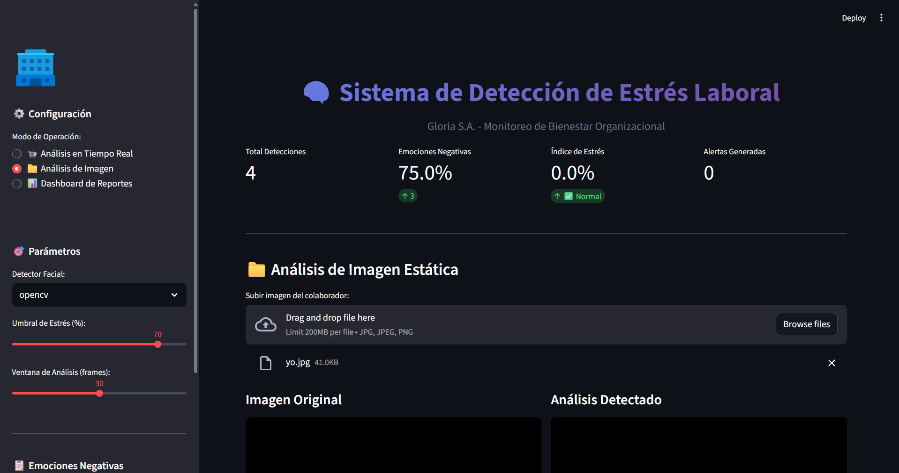
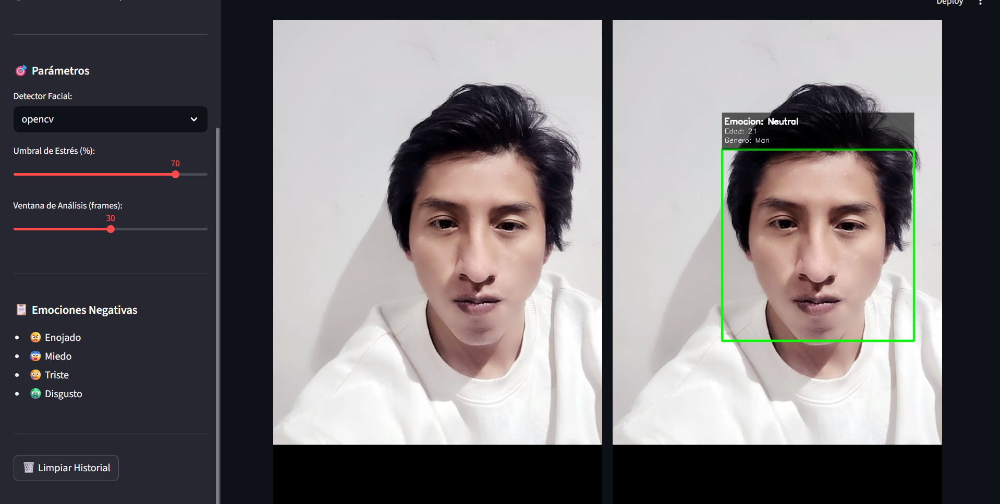
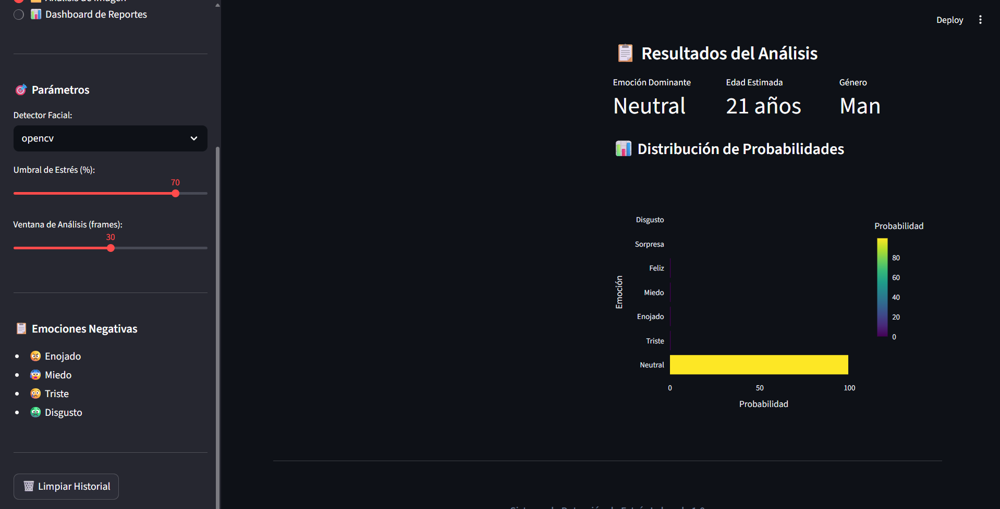
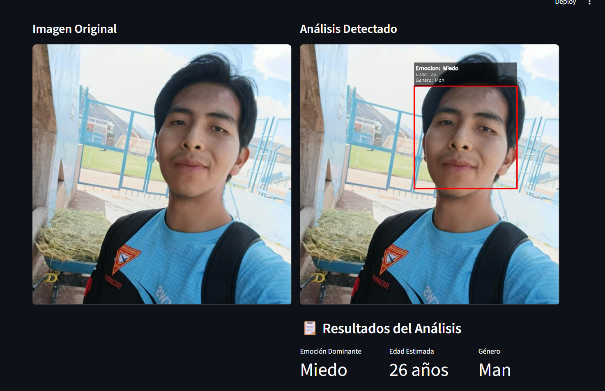
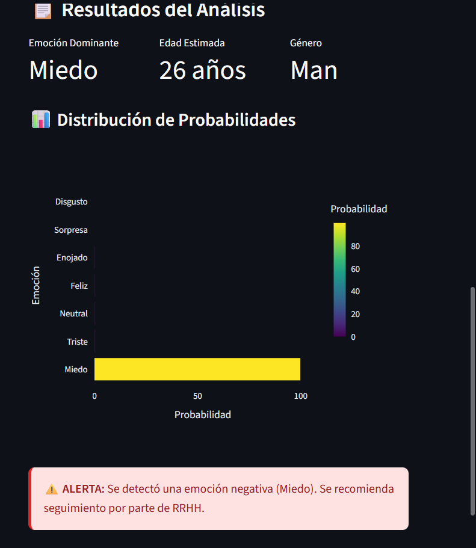
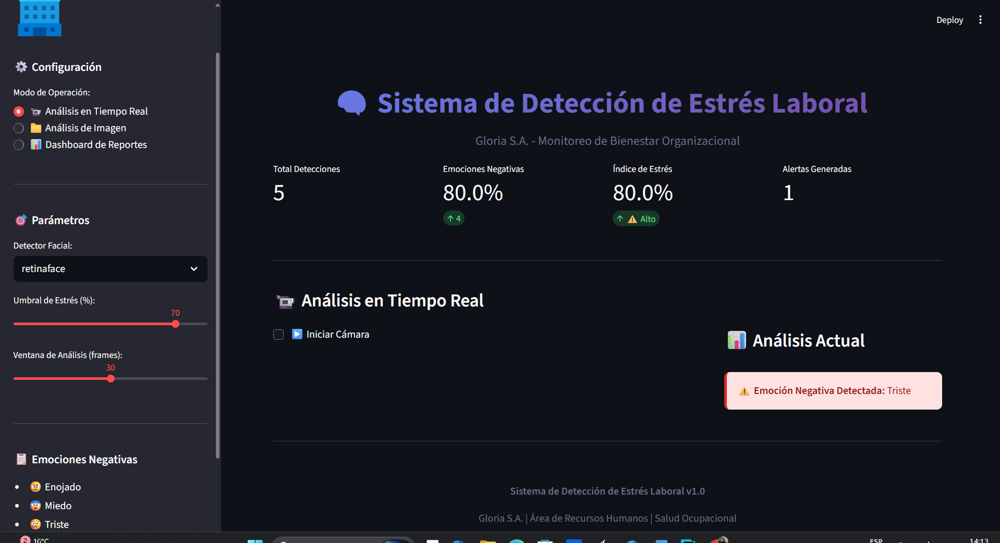

# 🧠 Sistema Avanzado de Detección de Estrés Laboral - Gloria S.A.


Sistema inteligente de monitoreo de bienestar organizacional basado en detección automática de emociones faciales mediante Deep Learning, optimizado para entornos empresariales con múltiples cámaras, reconocimiento facial de empleados, análisis predictivo y notificaciones automáticas.

---

## 📋 Tabla de Contenidos

- [Características Principales](#-características-principales)
- [Arquitectura del Sistema](#-arquitectura-del-sistema)
- [Requisitos del Sistema](#-requisitos-del-sistema)
- [Instalación](#-instalación)
- [Configuración](#-configuración)
- [Uso del Sistema](#-uso-del-sistema)
- [Estructura del Proyecto](#-estructura-del-proyecto)
- [Base de Datos](#-base-de-datos)
- [API y Módulos](#-api-y-módulos)
- [Personalización](#-personalización)
- [Troubleshooting](#-troubleshooting)
- [Contribución](#-contribución)
- [Licencia](#-licencia)
- [Autores](#-autores)

---






## 🚀 Características Principales

### 1️⃣ **Detección de Emociones en Tiempo Real**
- Reconocimiento facial automático usando DeepFace
- Identificación de 7 emociones: Enojado, Miedo, Triste, Disgusto, Neutral, Feliz, Sorpresa
- Análisis de edad y género
- Latencia < 200ms por frame

### 2️⃣ **Reconocimiento de Empleados**
- Sistema de identificación facial personalizado
- Base de datos de empleados con fotos
- Historial individual de detecciones
- Alertas personalizadas por empleado

### 3️⃣ **Monitoreo Multi-Cámara**
- Soporte para hasta 4 cámaras simultáneas
- Monitoreo de diferentes áreas de trabajo
- Vista en tiempo real de todas las cámaras
- Grabación de eventos críticos

### 4️⃣ **Análisis Predictivo con Machine Learning**
- Predicción de probabilidad de estrés alto
- Identificación de patrones temporales (hora, día)
- Análisis de factores de riesgo
- Tendencias y estadísticas avanzadas

### 5️⃣ **Sistema de Alertas Inteligente**
- Detección automática de niveles críticos de estrés
- Notificaciones por email en tiempo real
- Panel de gestión de alertas
- Estados: Pendiente, Revisada, Resuelta

### 6️⃣ **Dashboard Interactivo**
- Visualizaciones con Plotly
- Métricas en tiempo real
- Reportes exportables (CSV, PDF)
- Gráficos de tendencias y distribuciones

### 7️⃣ **Base de Datos SQLite Integrada**
- Almacenamiento persistente de detecciones
- Historial completo de empleados
- Registro de alertas y notificaciones
- Consultas y filtros avanzados

---

## 🏗️ Arquitectura del Sistema

```
┌─────────────────────────────────────────────────────────────┐
│                    INTERFAZ STREAMLIT                        │
│  ┌──────────┐ ┌──────────┐ ┌──────────┐ ┌──────────┐       │
│  │Dashboard │ │Multi-Cam │ │Empleados │ │Predictivo│       │
│  └──────────┘ └──────────┘ └──────────┘ └──────────┘       │
└─────────────────────────────────────────────────────────────┘
                              │
                              ▼
┌─────────────────────────────────────────────────────────────┐
│                    CAPA DE PROCESAMIENTO                     │
│  ┌────────────────┐  ┌─────────────────┐  ┌──────────────┐ │
│  │ DeepFace       │  │ Face Recognition│  │ ML Predictor │ │
│  │ - VGG-Face     │  │ - FaceNet       │  │ - RandomForest│ │
│  │ - Facenet      │  │ - Embeddings    │  │ - Sklearn     │ │
│  │ - ArcFace      │  └─────────────────┘  └──────────────┘ │
│  └────────────────┘                                          │
└─────────────────────────────────────────────────────────────┘
                              │
                              ▼
┌─────────────────────────────────────────────────────────────┐
│                    CAPA DE DATOS                             │
│  ┌────────────┐  ┌──────────────┐  ┌────────────────────┐  │
│  │  SQLite DB │  │ Notification │  │ File System        │  │
│  │  - empleados│  │ System       │  │ - Fotos empleados  │  │
│  │  - detecciones│ │ - SMTP      │  │ - Modelos ML       │  │
│  │  - alertas  │  │ - Email      │  │ - Logs             │  │
│  └────────────┘  └──────────────┘  └────────────────────┘  │
└─────────────────────────────────────────────────────────────┘
                              │
                              ▼
┌─────────────────────────────────────────────────────────────┐
│                    HARDWARE                                  │
│  ┌──────────┐  ┌──────────┐  ┌──────────┐  ┌──────────┐   │
│  │ Camera 1 │  │ Camera 2 │  │ Camera 3 │  │ Camera 4 │   │
│  └──────────┘  └──────────┘  └──────────┘  └──────────┘   │
└─────────────────────────────────────────────────────────────┘
```

---

## 💻 Requisitos del Sistema

### Hardware Mínimo
- **CPU:** Intel Core i5 o equivalente (Quad-core 2.5 GHz)
- **RAM:** 8 GB (16 GB recomendado)
- **Almacenamiento:** 10 GB libres
- **Cámara:** Webcam USB 720p o superior
- **GPU:** Opcional (NVIDIA CUDA para mejor rendimiento)

### Hardware Recomendado
- **CPU:** Intel Core i7 o AMD Ryzen 7
- **RAM:** 16 GB o más
- **GPU:** NVIDIA GTX 1060 o superior
- **Cámara:** Múltiples cámaras USB 1080p

### Software
- **Sistema Operativo:** Windows 10/11, Ubuntu 20.04+, macOS 10.15+
- **Python:** 3.8 o superior
- **Navegador:** Chrome, Firefox, Edge (últimas 3 versiones)

---

## 📦 Instalación

### Opción 1: Instalación Automática (Recomendada)

```bash
# 1. Clonar el repositorio
git clone https://github.com/tu-usuario/gloria-stress-detection.git
cd gloria-stress-detection

# 2. Crear entorno virtual
python -m venv venv

# Windows
venv\Scripts\activate

# Linux/Mac
source venv/bin/activate

# 3. Instalar dependencias
pip install -r requirements.txt

# 4. Ejecutar la aplicación
streamlit run app.py
```

### Opción 2: Instalación Manual

```bash
# Instalar dependencias principales
pip install streamlit==1.28.0
pip install opencv-python==4.8.1.78
pip install deepface==0.0.79
pip install pandas==2.1.1
pip install plotly==5.17.0
pip install scikit-learn==1.3.1
pip install tensorflow==2.14.0

# Dependencias adicionales
pip install numpy Pillow matplotlib seaborn
```

### Opción 3: Docker (Producción)

```bash
# Construir imagen
docker build -t gloria-stress-system .

# Ejecutar contenedor
docker run -p 8501:8501 \
  --device=/dev/video0:/dev/video0 \
  -v $(pwd)/data:/app/data \
  gloria-stress-system
```

---

## ⚙️ Configuración

### 1. Configuración Inicial

Al ejecutar por primera vez, el sistema creará automáticamente:

```
gloria-stress-detection/
├── gloria_stress_system.db    # Base de datos SQLite
├── employee_photos/            # Carpeta para fotos
├── logs/                       # Archivos de log
└── models/                     # Modelos ML entrenados
```

### 2. Configuración de Cámaras

En el sidebar de la aplicación:

```python
# Configurar número de cámaras
num_cameras = 1  # 1-4 cámaras

# Seleccionar detector
detector = 'retinaface'  # retinaface, mtcnn, opencv, ssd

# Configurar umbral de estrés
stress_threshold = 40  # Porcentaje (20-80)
```

### 3. Configuración de Email (SMTP)

Ir a: **⚙️ Configuración → Alertas y Notificaciones**

#### Gmail (Recomendado)

```
Servidor SMTP: smtp.gmail.com
Puerto: 587
Email: tu-email@gmail.com
Contraseña: tu-app-password (No tu contraseña normal)
```

**Generar App Password en Gmail:**
1. Ir a Google Account → Security
2. Activar 2-Step Verification
3. App Passwords → Generar nueva contraseña
4. Copiar la contraseña generada (16 caracteres)

#### Outlook/Hotmail

```
Servidor SMTP: smtp-mail.outlook.com
Puerto: 587
Email: tu-email@outlook.com
Contraseña: tu-contraseña
```

#### Gmail Corporativo (G Suite)

```
Servidor SMTP: smtp.gmail.com
Puerto: 587
Email: sistema@gloria.com.pe
Contraseña: contraseña-corporativa
```

### 4. Variables de Entorno (Opcional)

Crear archivo `.env`:

```bash
# Base de datos
DATABASE_NAME=gloria_stress_system.db

# Email
SMTP_SERVER=smtp.gmail.com
SMTP_PORT=587
SENDER_EMAIL=sistema@gloria.com.pe
SENDER_PASSWORD=tu-app-password
RECIPIENTS=rrhh@gloria.com.pe,jefe@gloria.com.pe

# Sistema
STRESS_THRESHOLD=40
DETECTOR=retinaface
MAX_CAMERAS=4
DEBUG=False
```

---

## 🎯 Uso del Sistema

### Inicio Rápido (5 minutos)

#### 1️⃣ **Ejecutar la Aplicación**

```bash
streamlit run app.py
```

Se abrirá automáticamente en: `http://localhost:8501`

#### 2️⃣ **Registrar Empleados**

1. Ir a **👥 Gestión de Empleados → Registrar Nuevo**
2. Completar formulario:
   - ID: `EMP001`
   - Nombre: `Juan Pérez`
   - Departamento: `Producción`
   - Email: `juan.perez@gloria.com.pe`
   - Foto: Subir imagen del rostro
3. Click en **✅ Registrar Empleado**

#### 3️⃣ **Iniciar Monitoreo**

1. Ir a **📹 Monitoreo Multi-Cámara**
2. Configurar parámetros:
   - Número de cámaras: `1`
   - Detector: `retinaface`
   - Umbral de estrés: `40%`
   - ✅ Activar reconocimiento de empleados
   - ✅ Activar notificaciones
3. Click en **▶️ Iniciar Monitoreo**

#### 4️⃣ **Revisar Dashboard**

1. Ir a **🏠 Dashboard Principal**
2. Visualizar:
   - Métricas en tiempo real
   - Gráficos de tendencias
   - Alertas generadas

---

## 📁 Estructura del Proyecto

```
gloria-stress-detection/
│
├── app.py                          # Aplicación principal Streamlit
├── requirements.txt                # Dependencias Python
├── README.md                       # Este archivo
├── .env                           # Variables de entorno (no incluir en Git)
├── .gitignore                     # Archivos ignorados por Git
│
├── modules/                       # Módulos del sistema
│   ├── __init__.py
│   ├── database_manager.py       # Gestión de base de datos
│   ├── notification_system.py    # Sistema de notificaciones
│   ├── face_recognition.py       # Reconocimiento facial
│   ├── predictive_analytics.py   # Análisis predictivo
│   └── utils.py                  # Funciones auxiliares
│
├── data/                          # Datos del sistema
│   ├── gloria_stress_system.db   # Base de datos SQLite
│   └── employee_photos/          # Fotos de empleados
│       ├── EMP001.jpg
│       ├── EMP002.jpg
│       └── ...
│
├── models/                        # Modelos entrenados
│   ├── stress_predictor_model.pkl
│   └── face_embeddings.pkl
│
├── logs/                          # Archivos de log
│   ├── system.log
│   ├── errors.log
│   └── detections.log
│
├── docs/                          # Documentación
│   ├── manual_usuario.pdf
│   ├── manual_tecnico.pdf
│   └── arquitectura.md
│
├── tests/                         # Tests unitarios
│   ├── test_database.py
│   ├── test_detection.py
│   └── test_notifications.py
│
├── config/                        # Archivos de configuración
│   ├── config.yaml
│   └── camera_config.json
│
└── scripts/                       # Scripts auxiliares
    ├── setup_database.py
    ├── migrate_data.py
    └── backup.sh
```

---

## 🗄️ Base de Datos

### Esquema de Base de Datos (SQLite)

#### Tabla: `employees`

| Campo | Tipo | Descripción |
|-------|------|-------------|
| id | INTEGER PRIMARY KEY | ID auto-incremental |
| employee_id | TEXT UNIQUE | ID único del empleado (ej: EMP001) |
| name | TEXT NOT NULL | Nombre completo |
| department | TEXT | Departamento/área |
| email | TEXT | Email corporativo |
| photo_path | TEXT | Ruta de la foto |
| created_at | TIMESTAMP | Fecha de registro |

#### Tabla: `detections`

| Campo | Tipo | Descripción |
|-------|------|-------------|
| id | INTEGER PRIMARY KEY | ID auto-incremental |
| employee_id | TEXT | ID del empleado (FK) |
| timestamp | TIMESTAMP | Fecha y hora de detección |
| emotion | TEXT | Emoción detectada |
| age | INTEGER | Edad estimada |
| gender | TEXT | Género estimado |
| stress_index | REAL | Índice de estrés (0-100) |
| camera_id | TEXT | ID de la cámara |

#### Tabla: `alerts`

| Campo | Tipo | Descripción |
|-------|------|-------------|
| id | INTEGER PRIMARY KEY | ID auto-incremental |
| employee_id | TEXT | ID del empleado (FK) |
| timestamp | TIMESTAMP | Fecha y hora de la alerta |
| alert_type | TEXT | Tipo: high_stress, critical |
| stress_level | REAL | Nivel de estrés detectado |
| description | TEXT | Descripción de la alerta |
| status | TEXT | Estado: pending, reviewed, resolved |

#### Tabla: `notification_config`

| Campo | Tipo | Descripción |
|-------|------|-------------|
| id | INTEGER PRIMARY KEY | ID (siempre 1) |
| smtp_server | TEXT | Servidor SMTP |
| smtp_port | INTEGER | Puerto SMTP |
| sender_email | TEXT | Email remitente |
| sender_password | TEXT | Contraseña (encriptada) |
| recipients | TEXT | Lista de destinatarios (CSV) |

### Consultas SQL Útiles

```sql
-- Total de detecciones por empleado
SELECT employee_id, COUNT(*) as total_detections
FROM detections
GROUP BY employee_id
ORDER BY total_detections DESC;

-- Promedio de estrés por departamento
SELECT e.department, AVG(d.stress_index) as avg_stress
FROM detections d
JOIN employees e ON d.employee_id = e.employee_id
GROUP BY e.department;

-- Alertas pendientes ordenadas por nivel
SELECT * FROM alerts
WHERE status = 'pending'
ORDER BY stress_level DESC;

-- Detecciones de la última hora
SELECT * FROM detections
WHERE timestamp >= datetime('now', '-1 hour');

-- Empleados con mayor estrés promedio
SELECT e.name, e.employee_id, AVG(d.stress_index) as avg_stress
FROM employees e
JOIN detections d ON e.employee_id = d.employee_id
GROUP BY e.employee_id
ORDER BY avg_stress DESC
LIMIT 10;
```

---

## 🔌 API y Módulos

### DatabaseManager

```python
from modules.database_manager import DatabaseManager

db = DatabaseManager("gloria_stress_system.db")

# Agregar empleado
db.add_employee(
    employee_id="EMP001",
    name="Juan Pérez",
    department="Producción",
    email="juan@gloria.com.pe",
    photo_path="photos/EMP001.jpg"
)

# Obtener detecciones
detections = db.get_detections(
    employee_id="EMP001",
    start_date="2024-01-01",
    end_date="2024-01-31"
)

# Agregar alerta
db.add_alert(
    employee_id="EMP001",
    alert_type="high_stress",
    stress_level=75.5,
    description="Alto nivel de estrés detectado"
)
```

### NotificationSystem

```python
from modules.notification_system import NotificationSystem

notif = NotificationSystem(db_manager)

# Configurar email
notif.save_config(
    smtp_server="smtp.gmail.com",
    smtp_port=587,
    sender_email="sistema@gloria.com.pe",
    sender_password="app-password",
    recipients=["rrhh@gloria.com.pe"]
)

# Enviar alerta
notif.send_alert_email(
    employee_name="Juan Pérez",
    employee_id="EMP001",
    stress_level=75.5,
    emotion="Enojado"
)
```

### FaceRecognitionSystem

```python
from modules.face_recognition import FaceRecognitionSystem

face_recog = FaceRecognitionSystem(db_manager)

# Identificar persona en frame
employee_id = face_recog.identify_person(frame)

if employee_id:
    print(f"Empleado identificado: {employee_id}")
```

### PredictiveAnalytics

```python
from modules.predictive_analytics import PredictiveAnalytics

predictor = PredictiveAnalytics(db_manager)

# Predecir probabilidad de estrés
probability = predictor.predict_stress(
    hour=14,              # 2 PM
    day_of_week=2,        # Miércoles
    emotion='sad',
    age=35
)

print(f"Probabilidad de estrés alto: {probability*100:.1f}%")

# Obtener tendencias
trends = predictor.get_stress_trends(
    employee_id="EMP001",
    days=7
)
```

---

## 🎨 Personalización

### Cambiar Emociones Negativas

```python
# En app.py, línea ~200
NEGATIVE_EMOTIONS = ['angry', 'fear', 'sad', 'disgust']

# Puedes agregar 'surprise' si lo consideras negativo
NEGATIVE_EMOTIONS = ['angry', 'fear', 'sad', 'disgust', 'surprise']
```

### Ajustar Colores del Dashboard

```python
# En app.py, sección CSS
st.markdown("""
<style>
    .main-header {
        background: linear-gradient(135deg, #FF6B6B 0%, #4ECDC4 100%);
    }
</style>
""", unsafe_allow_html=True)
```

### Cambiar Modelos de DeepFace

```python
# En analyze_frame(), línea ~250
results = DeepFace.analyze(
    frame,
    actions=['emotion', 'age', 'gender'],
    detector_backend='retinaface',  # Cambiar aquí
    enforce_detection=False,
    model_name='VGG-Face'  # Cambiar modelo: Facenet, ArcFace, etc.
)
```

### Agregar Nuevos Detectores

```python
DETECTOR_OPTIONS = [
    'retinaface',  # Más preciso
    'mtcnn',       # Rápido
    'opencv',      # Más ligero
    'ssd',         # Balanceado
    'dlib',        # Alternativo
    'mediapipe'    # Más reciente
]
```

---

## 🛠️ Troubleshooting

### Problema 1: Cámara no detectada

**Error:** `No se pudo acceder a la cámara`

**Soluciones:**
```bash
# Verificar cámaras disponibles
python -c "import cv2; print([i for i in range(4) if cv2.VideoCapture(i).isOpened()])"

# Dar permisos a la cámara
# Windows: Configuración → Privacidad → Cámara
# Linux: sudo chmod 666 /dev/video0
```

### Problema 2: Error de importación de TensorFlow

**Error:** `ModuleNotFoundError: No module named 'tensorflow'`

**Soluciones:**
```bash
# Reinstalar TensorFlow
pip uninstall tensorflow
pip install tensorflow==2.14.0

# Si tienes GPU NVIDIA
pip install tensorflow-gpu==2.14.0
```

### Problema 3: DeepFace muy lento

**Soluciones:**
```python
# 1. Cambiar a detector más rápido
detector = 'opencv'  # En lugar de 'retinaface'

# 2. Reducir frecuencia de análisis
if frame_counter % 10 == 0:  # Analizar cada 10 frames en lugar de 5
    results = analyze_frame(frame, detector)

# 3. Reducir resolución de cámara
cap.set(cv2.CAP_PROP_FRAME_WIDTH, 640)
cap.set(cv2.CAP_PROP_FRAME_HEIGHT, 480)
```

### Problema 4: Email no se envía

**Error:** `SMTPAuthenticationError`

**Soluciones:**
```python
# 1. Verificar que usas App Password (Gmail)
# 2. Verificar configuración SMTP
# 3. Desactivar antivirus temporalmente
# 4. Probar con otro puerto
smtp_port = 465  # SSL en lugar de 587 (TLS)
```

### Problema 5: Base de datos bloqueada

**Error:** `sqlite3.OperationalError: database is locked`

**Soluciones:**
```bash
# 1. Cerrar todas las instancias de la aplicación
pkill -f streamlit

# 2. Eliminar locks
rm gloria_stress_system.db-wal
rm gloria_stress_system.db-shm

# 3. Hacer backup y recrear
cp gloria_stress_system.db gloria_stress_system.db.backup
sqlite3 gloria_stress_system.db "VACUUM;"
```

### Problema 6: Reconocimiento facial no funciona

**Soluciones:**
```python
# 1. Verificar que las fotos son de buena calidad
# - Resolución mínima: 640x480
# - Rostro centrado y frontal
# - Buena iluminación

# 2. Ajustar umbral de similitud
# En face_recognition.py, línea ~50
if distance < 0.7:  # Aumentar de 0.6 a 0.7 (menos estricto)
    identified_id = emp_id

# 3. Usar modelo más robusto
embedding = DeepFace.represent(
    emp['photo_path'],
    model_name='ArcFace',  # Cambiar de Facenet a ArcFace
    enforce_detection=False
)
```

---

## 📊 Métricas y KPIs del Sistema

| Métrica | Objetivo | Fórmula |
|---------|----------|---------|
| **Precisión de Detección** | ≥ 84% | (TP + TN) / Total × 100 |
| **Latencia por Frame** | ≤ 200ms | Tiempo de procesamiento |
| **Tasa de Falsos Positivos** | ≤ 15% | FP / (FP + TN) × 100 |
| **Disponibilidad del Sistema** | ≥ 95% | Uptime / Total Time × 100 |
| **Tiempo de Detección de Estrés** | ≤ 1 semana | Desde aparición hasta detección |
| **Correlación con Indicadores** | ≥ 0.7 | Correlación de Pearson |
| **Aceptación de Empleados** | ≥ 75% | Encuesta post-implementación |
| **ROI a 2 años** | ≥ 800% | (Beneficios - Inversión) / Inversión × 100 |

---

## 🧪 Testing

### Tests Unitarios

```bash
# Ejecutar todos los tests
python -m pytest tests/

# Test específico
python -m pytest tests/test_database.py -v

# Con cobertura
python -m pytest --cov=modules tests/
```

### Tests de Integración

```bash
# Test del sistema completo
python scripts/integration_test.py
```

### Tests de Rendimiento

```bash
# Benchmark de detección
python scripts/benchmark_detection.py

# Benchmark de base de datos
python scripts/benchmark_database.py
```

---

## 🚀 Despliegue en Producción

### Docker Compose

```yaml
version: '3.8'
services:
  gloria-stress-system:
    build: .
    ports:
      - "8501:8501"
    devices:
      - /dev/video0:/dev/video0
    volumes:
      - ./data:/app/data
      - ./employee_photos:/app/employee_photos
    environment:
      - STRESS_THRESHOLD=40
      - DETECTOR=retinaface
    restart: always
```

### Nginx Reverse Proxy

```nginx
server {
    listen 80;
    server_name stress-monitor.gloria.com.pe;

    location / {
        proxy_pass http://localhost:8501;
        proxy_http_version 1.1;
        proxy_set_header Upgrade $http_upgrade;
        proxy_set_header Connection "upgrade";
        proxy_set_header Host $host;
    }
}
```

### Systemd Service (Linux)

```ini
[Unit]
Description=Gloria Stress Detection System
After=network.target

[Service]
Type=simple
User=www-data
WorkingDirectory=/opt/gloria-stress-detection
ExecStart=/opt/gloria-stress-detection/venv/bin/streamlit run app.py
Restart=always

[Install]
WantedBy=multi-user.target
```

---

## 📚 Recursos Adicionales

### Documentación
- [DeepFace Documentation](https://github.com/serengil/deepface)
- [Streamlit Documentation](https://docs.streamlit.io)
- [OpenCV Python Tutorial](https://docs.opencv.org/4.x/d6/d00/tutorial_py_root.html)

### Papers de Referencia
- **FER2013 Dataset:** "Challenges in Representation Learning: A report on three machine learning contests" (Goodfellow et al., 2013)
- **DeepFace:** "DeepFace: Closing the Gap to Human-Level Performance" (Taigman et al., 2014)
- **FaceNet:** "FaceNet: A Unified Embedding for Face Recognition" (Schroff et al., 2015)

### Comunidad
- [GitHub Issues](https://github.com/tu-usuario/gloria-stress-detection/issues)
- [Discussions](https://github.com/tu-usuario/gloria-stress-detection/discussions)
- Email: soporte@gloria-stress-system.com

---

## 🤝 Contribución

¡Las contribuciones son bienvenidas! Por favor:

1. Fork el proyecto
2. Crea una rama para tu feature (`git checkout -b feature/AmazingFeature`)
3. Commit tus cambios (`git commit -m 'Add some AmazingFeature'`)
4. Push a la rama (`git push origin feature/AmazingFeature`)
5. Abre un Pull Request

### Estándares de Código
- Seguir PEP 8 para Python
- Documentar funciones con docstrings
- Agregar tests para nuevas funcionalidades
- Actualizar README si es necesario

---

## 📄 Licencia

Este proyecto está bajo la Licencia MIT. Ver archivo `LICENSE` para más detalles.

```
MIT License

Copyright (c) 2024 Gloria S.A.

Permission is hereby granted, free of charge, to any person obtaining a copy
of this software and associated documentation files (the "Software"), to deal
in the Software without restriction...
```

---

## 👥 Autores
